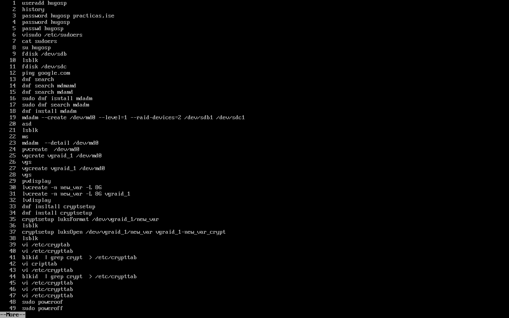

En esta sesión vamos a montar un nuevo LVM con difrado.
Para empezar hemos creado dos pariciones en el disco, sdb y sdc, para ello hemos usado fdisk y dentro de su menú hemos usado: n para una nueva partición, p para indicar que es primaria, 1 que indica el numero de la particion, para los sectores hemos puesto 2048 y acaba en el final del disco, w para escribir (esto lo hacemos en las dos particiones)
Como tenemos que descargar paquetes, vamos a comprobar si tenemos conexion a internet usando ping google.com.
Para instalar los paquetes usamos: sudo dnf search mdadm y dnf install mdadm

hacemos mdadm --create /dev/md0 --level=1 --raid-devices=2 /dev/sdb1 /dev/sdc1 para crear una raid de nivel 1 en sdb1 y sdc1

ahora creamos el PV y VG sobre el PV y le asignamos 8GB al new_var del raid1

ahora instalamos cryptsetup de la misma manera que hemos instalado el mdadm.

Formateamos el disco con: cryptsetup luksFormat /dev/vg_raid1/new_var
Y con luksOpen vamos a activar el cifrado de los datos sobre un nuevo var que se llamará new_var_crypt

Cada vez que apaguemos la máquina, el cifrado se perderá y abra que hacer otra vez el luksOpen, para que no nos pse eso, vamos a hacer:
blkid | grep crypto > /etc/crypttab
esto va a guardar la linea de comando que va a hacer que se encripte, de esta forma, cada vez que encendamos el ordenador nos va a pedir la palabra de cifrado y se cifrará el disco
Ya hemos hecho el LUKS, ahora tenemos que montar el LVM siguiendo la misma estructura que en la Práctica1 Lección2

